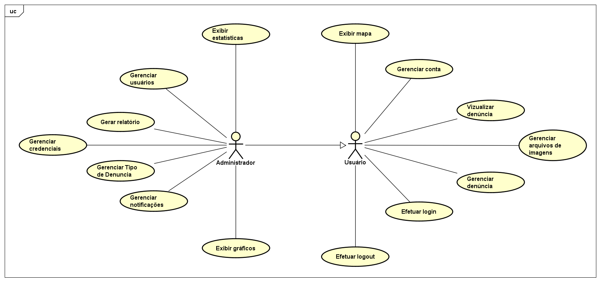

# Especificação do projeto

## Definição do problema

O principal problema abordado por este projeto é a falha na comunicação entre os moradores urbanos e os responsáveis pela manutenção da infraestrutura. Essa deficiência resulta em atrasos, ineficiências e até mesmo na ausência de ação na resolução de problemas comuns, tais como vazamentos de água, ruas esburacadas, falhas na iluminação pública e problemas de saneamento básico.

## Solução

A solução proposta é o desenvolvimento de um aplicativo que permita aos cidadãos reportar qualquer tipo de problema relacionado à infraestrutura urbana. Dessa forma, busca-se evitar que essas questões se prolonguem, minimizando impactos negativos na convivência urbana e garantindo uma resposta mais ágil e eficiente por parte das autoridades responsáveis.

## Ferramentas e Técnicas

- **Diagrama de Personas:** Representação dos perfis dos usuários-alvo da plataforma.

- **Histórias de Usuários:** Levantamento das necessidades e expectativas dos usuários com base em suas rotinas e desafios.

- **Requisitos Funcionais e Não Funcionais:** Definição detalhada das funcionalidades essenciais e dos aspectos técnicos que a solução deve atender.

- **Diagrama de Caso de Uso:** Modelagem dos principais fluxos de interação dos usuários com o sistema.

## Personas

## 1 - João Fernandes, 40 anos - Funcionário Público (Administrador do Sistema)
Responsável por gerenciar e responder às denúncias feitas pelos cidadãos.
Precisa de um painel para visualizar, organizar e atualizar o status das denúncias.
Quer um sistema eficiente que facilite a comunicação com outros órgãos responsáveis.

## 2 - Pedro Paulo, 47 anos - Pedreiro
Pedro Paulo enfrenta dificuldades no trajeto para o trabalho devido a um desvio causado pela queda de uma árvore. Ele já solicitou a remoção da árvore, porém não obteve resposta das autoridades responsáveis. Diante da falta de retorno, ele busca um meio adequado para registrar sua reclamação e obter uma solução.  

## 3 - Mariana Medeiros, 20 anos - Estudante
Mariana Medeiros retorna da faculdade por uma rua com iluminação precária devido à ausência de postes de luz. Ela já tentou identificar o órgão responsável pela instalação dos postes, mas não obteve sucesso. Em razão disso, procura uma maneira digital, simples e acessível para relatar o problema e contribuir para a melhoria da segurança na região.  

## 4 - Anderson Arantes, 36 anos - Empresário
Anderson Arantes observou um aumento expressivo nas contas de água devido a um vazamento na rua próximo ao seu estabelecimento. No entanto, ele não sabe a quem recorrer para solicitar o reparo do vazamento e a regularização das tarifas afetadas. Diante dessa situação, busca uma solução eficiente para relatar o problema e minimizar os impactos financeiros causados.

## Histórias de usuários

Com base na análise das personas, foram identificadas as seguintes histórias de usuários:

|EU COMO... `PERSONA`| QUERO/PRECISO ... `FUNCIONALIDADE` |PARA ... `MOTIVO/VALOR`                 |
|--------------------|------------------------------------|----------------------------------------|
|João Fernandes      | Gerenciar e responder denúncias    | Garantir que as solicitações sejam tratadas rapidamente |
|Pedro Paulo         | Registrar denúncias de obstáculos nas vias públicas | Relatar problemas como quedas de árvores para evitar transtornos no trajeto |
|Mariana Medeiros    | Registrar falta de iluminação pública | Relatar ruas escuras para melhorar a segurança |
|Anderson Arantes    | Reportar vazamentos de água | Solicitar reparo e evitar desperdício e aumento da conta |

## Requisitos

As tabelas a seguir apresentam os requisitos funcionais e não funcionais que detalham o escopo do projeto. Para determinar a prioridade dos requisitos, aplique uma técnica de priorização e detalhe como essa técnica foi aplicada.

### Requisitos funcionais

|ID    | Descrição do Requisito  | Prioridade |
|------|-----------------------------------------|----|
|RF-001| Gerenciar usuários | ALTA | 
|RF-002| Gerenciar credenciais  | ALTA |
|RF-003| Gerenciar Tipo de Denúncia | ALTA |
|RF-004| Gerenciar notificações | MÉDIA |
|RF-005| Gerenciar conta   | MÉDIA |
|RF-006| Gerenciar arquivos de imagens | ALTA |
|RF-007| Gerenciar denúncia | ALTA |
|RF-008| Gerar relatório | ALTA |
|RF-009| Efetuar login  | MÉDIA |
|RF-010| Efetuar logout  | MÉDIA |
|RF-011| Exibir estatísticas  | MÉDIA |
|RF-012| Exibir gráficos  | MÉDIA |
|RF-013| Exibir mapa  | MÉDIA |
|RF-014| Visualizar denúncia  | MÉDIA |

### Requisitos não funcionais

|ID     | Descrição do Requisito  |Prioridade |
|-------|-------------------------|----|
|RNF-001| O sistema deve ser responsivo para rodar em dispositivos móveis | MÉDIA | 
|RNF-002| O sistema deve processar as requisições do usuário em no máximo 3 segundo |  BAIXA | 
|RNF-003| O sistema deve ser de fácil usabilidade |  BAIXA | 
|RNF-004| O sistema deve carregar as denúcnias rapidamente |  MÉDIA | 
|RNF-005| Os dados do usuário devem ser protegidos, especialmente e-mails e senhas |  ALTA | 
|RNF-006| O sistema deve funcionar nos principais navegadores e dispositivos móveis |  MÉDIA | 
|RNF-007| O banco de dados deve ser otimizado para suportar grandes quantidades de dados |  ALTA | 

## Restrições

O projeto está restrito aos itens apresentados na tabela a seguir.

|ID| Restrição                                             |
|--|-------------------------------------------------------|
|001| O projeto deverá ser entregue até o final do semestre |
|002| O custo total do projeto não deve exceder o orçamento definido |

## Diagrama de casos de uso

O diagrama de casos de uso é o próximo passo após a elicitação de requisitos. Ele utiliza um modelo gráfico e uma tabela com as descrições sucintas dos casos de uso e dos atores. O diagrama contempla a fronteira do sistema e o detalhamento dos requisitos funcionais, com a indicação dos atores, casos de uso e seus relacionamentos.

