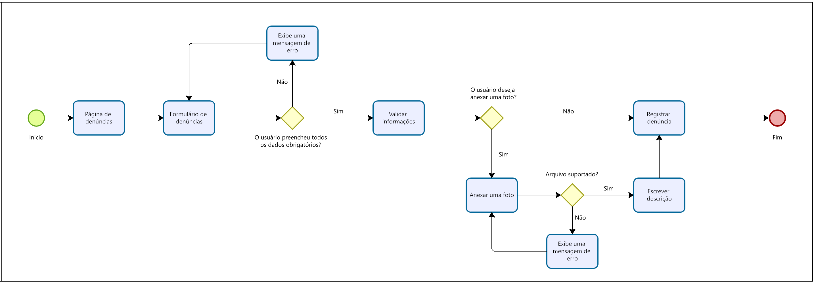

# Projeto de interface

Pré-requisitos: <a href="02-Especificacao.md"> Especificação do projeto</a>

Este projeto visa o desenvolvimento de um aplicativo para facilitar a comunicação entre os cidadãos e os responsáveis pela manutenção da infraestrutura urbana, solucionando problemas como vazamentos de água, buracos nas ruas, iluminação pública precária e saneamento básico.

 
 ## Visão Geral da Interação do Usuário

 
A interação do usuário foi projetada para ser intuitiva e responsiva, seguindo as necessidades identificadas nas Personas e Histórias de Usuário. As telas são organizadas de forma a permitir que o usuário cadastre uma denúncia de maneira rápida e eficaz, acompanhe o status da sua solicitação e, quando aplicável, receba atualizações de resolução.

- **Tela de Login e Cadastro:** Onde o usuário cria uma conta ou acessa o sistema para registrar e acompanhar denúncias.
- **Tela Registrar Denúncia:** Formulário simples e objetivo para descrever o problema, enviar imagens e indicar a localização no mapa.
- **Tela de Acompanhamento:** Permite ao cidadão consultar o status da sua denúncia em tempo real.

## Como a Interface Atende aos Requisitos

 
A construção das telas foi diretamente orientada pelos requisitos levantados na especificação do projeto:

 
### Requisitos Funcionais
- Cadastro e Autenticação (RF-001 e RF-002) são atendidos na tela de login/cadastro.
- Registro de Denúncia (RF-003) e Envio de Imagens (RF-004) são contemplados no formulário de denúncia.
- Status das Demandas (RF-007) é exibido tanto para o administrador quanto para o usuário comum, garantindo transparência.
- Interface Intuitiva (RF-008) foi prioridade no design das telas, utilizando ícones claros, textos objetivos e navegação simplificada.
- Confirmação da Denúncia (RF-009) ocorre após o envio do formulário.

### Requisitos Não Funcionais
- Proteção de Dados (RNF-005) foi considerada, garantindo segurança em login e cadastro.
- Disponibilidade (RNF-006) e Suporte a Diversos Navegadores (RNF-007) também foram levados em conta na escolha das tecnologias.
- A otimização do banco de dados (RNF-008) é fundamental para o carregamento rápido das denúncias, especialmente na tela de mapa.

As interfaces foram planejadas para atender de forma eficiente os diferentes perfis de usuários identificados nas personas. O fluxo de navegação é objetivo e prioriza a rápida comunicação de problemas urbanos, oferecendo uma solução digital de fácil acesso para a população.

## User flow

Fluxo de usuário (user flow) é uma técnica que permite ao desenvolvedor mapear todo o fluxo de navegação do usuário na aplicação. Essa técnica serve para alinhar os caminhos e as possíveis ações que o usuário pode realizar junto com os membros da equipe.

> **Links úteis**:
> - [User flow: o quê é e como fazer?](https://medium.com/7bits/fluxo-de-usu%C3%A1rio-user-flow-o-que-%C3%A9-como-fazer-79d965872534)
> - [User flow vs site maps](http://designr.com.br/sitemap-e-user-flow-quais-as-diferencas-e-quando-usar-cada-um/)
> - [Top 25 user flow tools & templates for smooth](https://www.mockplus.com/blog/post/user-flow-tools)

### Diagrama de fluxo

Para garantir uma experiência de navegação clara, intuitiva e eficiente, foram desenvolvidos fluxogramas representando o caminho percorrido pelo usuário nas principais funcionalidades da aplicação: login, cadastro e registro de denúncia.

Esses fluxos auxiliam na visualização do comportamento do sistema, demonstrando como as interações são organizadas e de que forma o usuário é conduzido de maneira lógica e objetiva em cada etapa. A estrutura prioriza a simplicidade e a rapidez no acesso às funções essenciais, reforçando o compromisso com a usabilidade e a inclusão digital.

### Fluxo de Cadastro

### Fluxo de Login

### Fluxo de Denúncia

## Wireframes

São protótipos usados no design de interface para sugerir a estrutura de um site web e seu relacionamento entre suas páginas. Um wireframe web é uma ilustração que mostra o layout dos elementos fundamentais na interface.

 
> **Links úteis**:
> - [Protótipos: baixa, média ou alta fidelidade?](https://medium.com/ladies-that-ux-br/prot%C3%B3tipos-baixa-m%C3%A9dia-ou-alta-fidelidade-71d897559135)
> - [Protótipos vs wireframes](https://www.nngroup.com/videos/prototypes-vs-wireframes-ux-projects/)
> - [Ferramentas de wireframes](https://rockcontent.com/blog/wireframes/)
> - [MarvelApp](https://marvelapp.com/developers/documentation/tutorials/)
> - [Figma](https://www.figma.com/)
> - [Adobe XD](https://www.adobe.com/br/products/xd.html#scroll)
> - [Axure](https://www.axure.com/edu) (Licença Educacional)
> - [InvisionApp](https://www.invisionapp.com/) (Licença Educacional)

## Interface do sistema

Visão geral da interação do usuário por meio das telas do sistema. 

### Tela principal do sistema

 imagem apresenta a tela principal do sistema, voltado para a promoção de cidades e comunidades sustentáveis, em alinhamento com o Objetivo 11 da Agenda 2030 da ONU. No centro, há um banner destacando os "Objetivos de Desenvolvimento Sustentável", com ênfase no tema de urbanização sustentável. Abaixo, o usuário encontra duas opções de ação: "Verificar status da denúncia" e "Registrar denúncia". No topo da página, há um menu de navegação com os botões "Início" e "Sobre", além de ícones de acesso à conta e logout. O layout utiliza uma paleta de cores em tons de verde e cinza, transmitindo modernidade e compromisso ambiental. 

###  Tela de login

A imagem apresenta a página de login do sistema. À esquerda, destaca-se uma fotografia urbana com o título "Cidades e Comunidades Sustentáveis" em letras grandes e brancas, remetendo ao conceito de desenvolvimento sustentável. À direita, em um fundo claro, encontra-se o logo da plataforma "ECO" e a mensagem motivacional "Seu acesso para mudar o presente e construir o futuro!". Abaixo, são disponibilizados campos para inserção de E-mail e Senha, seguidos de um botão verde "Login". Há também a opção "Criar uma conta", destinada a novos usuários.

### Tela de cadastro

A imagem exibe a página de cadastro do sistema. No topo, há o título "Crie seu cadastro", seguido de um formulário estruturado com campos obrigatórios para inserção de Nome, Sobrenome, CPF, Telefone, E-mail e Senha. Abaixo do formulário, encontra-se o botão verde "Cadastre-se", que permite a submissão dos dados preenchidos. Há também uma caixa de seleção para o usuário concordar com os Termos de Uso e a Política de Privacidade antes de concluir o cadastro.

### Tela registrar denúncias

A imagem apresenta a página de registro de denúncias do sistema. No topo, encontra-se o título "Página de Denúncia". O formulário disponibiliza campos obrigatórios para preenchimento da Rua, Bairro, Tipo de denúncia e descrição detalhada do problema. Abaixo, há a opção de anexar uma foto, permitindo incluir uma descrição e selecionar um arquivo para envio. Os botões "Anexar" e "Cancelar" controlam o envio do anexo, enquanto o botão "Registrar denúncia" finaliza o processo.

### Tela "Sobre"

A imagem apresenta a seção "Sobre" do sistema. No espaço principal, encontra-se um texto descritivo (atualmente utilizado como conteúdo provisório) que será futuramente substituído pelo objetivo do projeto. Abaixo do texto, há um campo de "Dúvidas?", com informações de contato destacadas em botões verdes: um site de suporte (CIDADESSUSTENTÁVEIS.COM.BR) e um número de telefone para atendimento via SAC. 

