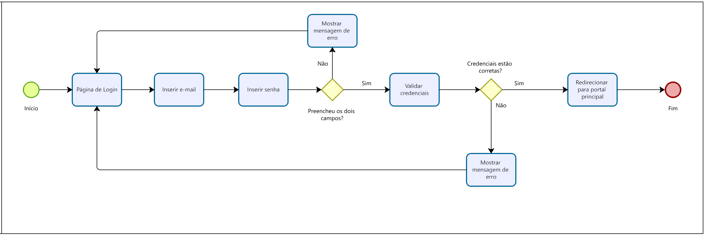

# Projeto de interface

Pré-requisitos: <a href="02-Especificacao.md"> Especificação do projeto</a>

Visão geral da interação do usuário pelas telas do sistema e protótipo interativo das telas com as funcionalidades que fazem parte do sistema (wireframes).

 Apresente as principais interfaces da plataforma. Discuta como ela foi elaborada de forma a atender os requisitos funcionais, não funcionais e histórias de usuário abordados na <a href="02-Especificacao.md"> Especificação do projeto</a>.

 ## User flow

Fluxo de usuário (user flow) é uma técnica que permite ao desenvolvedor mapear todo o fluxo de navegação do usuário na aplicação. Essa técnica serve para alinhar os caminhos e as possíveis ações que o usuário pode realizar junto com os membros da equipe.

> **Links úteis**:
> - [User flow: o quê é e como fazer?](https://medium.com/7bits/fluxo-de-usu%C3%A1rio-user-flow-o-que-%C3%A9-como-fazer-79d965872534)
> - [User flow vs site maps](http://designr.com.br/sitemap-e-user-flow-quais-as-diferencas-e-quando-usar-cada-um/)
> - [Top 25 user flow tools & templates for smooth](https://www.mockplus.com/blog/post/user-flow-tools)

### Diagrama de fluxo

Para garantir uma experiência de navegação clara, intuitiva e eficiente, foram desenvolvidos fluxogramas representando o caminho percorrido pelo usuário nas principais funcionalidades da aplicação: login, cadastro e registro de denúncia.

Esses fluxos auxiliam na visualização do comportamento do sistema, demonstrando como as interações são organizadas e de que forma o usuário é conduzido de maneira lógica e objetiva em cada etapa. A estrutura prioriza a simplicidade e a rapidez no acesso às funções essenciais, reforçando o compromisso com a usabilidade e a inclusão digital.

### Fluxo de cadastro

### Fluxo de Login

## Wireframes

São protótipos usados no design de interface para sugerir a estrutura de um site web e seu relacionamento entre suas páginas. Um wireframe web é uma ilustração que mostra o layout dos elementos fundamentais na interface.

 
> **Links úteis**:
> - [Protótipos: baixa, média ou alta fidelidade?](https://medium.com/ladies-that-ux-br/prot%C3%B3tipos-baixa-m%C3%A9dia-ou-alta-fidelidade-71d897559135)
> - [Protótipos vs wireframes](https://www.nngroup.com/videos/prototypes-vs-wireframes-ux-projects/)
> - [Ferramentas de wireframes](https://rockcontent.com/blog/wireframes/)
> - [MarvelApp](https://marvelapp.com/developers/documentation/tutorials/)
> - [Figma](https://www.figma.com/)
> - [Adobe XD](https://www.adobe.com/br/products/xd.html#scroll)
> - [Axure](https://www.axure.com/edu) (Licença Educacional)
> - [InvisionApp](https://www.invisionapp.com/) (Licença Educacional)

## Interface do sistema

Visão geral da interação do usuário por meio das telas do sistema. 

### Tela principal do sistema

Tela do portal de denúncias onde o usuário vai entrar após 

> Insira aqui a tela principal do sistema

###  Telas do processo 1

Descrição da tela relativa à atividade 1 do processo 1.

> Insira aqui a tela da atividade 1

Descrição da tela relativa à atividade 2 do processo 1.

> Insira aqui a tela da atividade 2

### Telas do processo 2

Descrição da tela relativa à atividade 1 do processo 2.

> Insira aqui a tela da atividade 1

Descrição da tela relativa à atividade 2 do processo 2.

> Insira aqui a tela da atividade 2
