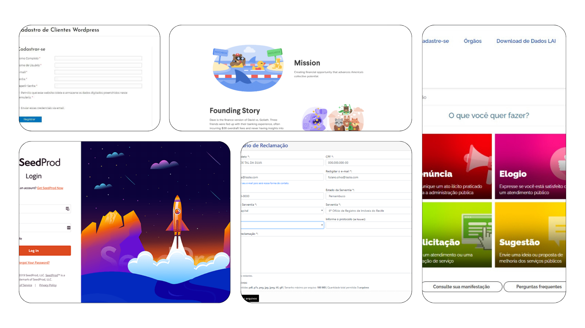
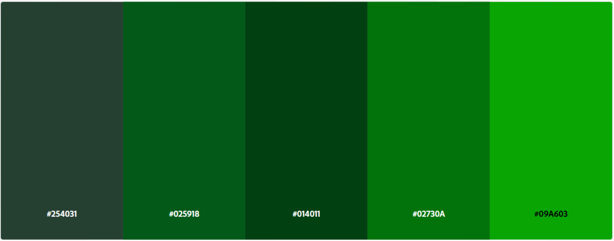

# Template padrão da aplicação

Pré-requisitos: <a href="02-Especificacao.md"> Especificação do projeto</a>, <a href="03-Metodologia.md"> Metodologia</a>, <a href="04-Projeto-interface.md"> Projeto de interface</a>

Nesse tópico irá abordar todo o processo de construção do template que será usado no site, incuindo cores, tipografia, logo, entre outros.

## Identidade visual

A identidade visual do UrbanReportPortal é um elemento essencial na construção do projeto, pois comunica os valores de inovação, cidadania ativa e sustentabilidade que a plataforma propõe. Mais do que estética, a identidade visual visa transmitir confiança, modernidade e o compromisso com a transformação positiva da infraestrutura urbana.

O desenvolvimento da identidade visual iniciou-se com uma pesquisa focada em referências de cidades inteligentes, aplicativos de participação cidadã e plataformas de gestão urbana. Buscou-se traduzir esses conceitos em elementos gráficos que equilibrassem simplicidade, eficiência e apelo visual, conectando o usuário à ideia de uma cidade mais humana e sustentável.

A proposta estética opta por uma abordagem leve e acessível, remetendo à tecnologia de forma amigável e não intimidante. Embora muitos projetos de inovação urbana associem tecnologia a sofisticação e exclusividade, o UrbanReportPortal reforça que soluções inteligentes devem ser inclusivas, fáceis de usar e voltadas ao bem coletivo.

O foco principal da plataforma é incentivar a comunicação entre cidadãos e gestores públicos, simplificando o processo de registro e acompanhamento de problemas urbanos — como falhas na iluminação pública, ruas danificadas, ou problemas de saneamento básico. A identidade visual, portanto, reforça a ideia de que a transformação das cidades pode ser feita de maneira participativa, moderna e sustentável.

Durante o processo de criação, foram pesquisadas referências de aplicativos de mobilidade urbana, plataformas governamentais de serviço ao cidadão e projetos de cidades sustentáveis. Essa combinação garantiu uma base sólida para a construção de uma identidade visual que não apenas se destaca, mas também gera conexão emocional com os usuários, estimulando a participação ativa na melhoria contínua do ambiente urbano.

## Paleta

Para a construção visual da plataforma, foi selecionada uma paleta de tons verdes (#254031, #025918, #014011, #02730A, #09A603), cuidadosamente escolhida para transmitir confiança, sustentabilidade e responsabilidade social — princípios essenciais para plataformas de gestão urbana e cidadania.

A cor verde é frequentemente associada a conceitos de crescimento, equilíbrio, renovação e compromisso ambiental. Em sites governamentais e projetos de cidades inteligentes, tons de verde reforçam a sensação de transparência, cuidado com o meio ambiente e proximidade com a população. Além disso, variações de verde mais escuro trazem seriedade e solidez institucional, enquanto os tons mais claros geram acolhimento e acessibilidade, equilibrando modernidade e tradição.

Essa paleta foi estrategicamente adotada para reforçar os valores de cidadania ativa, colaboração pública e construção de cidades mais sustentáveis, alinhando a identidade visual ao propósito da plataforma.

