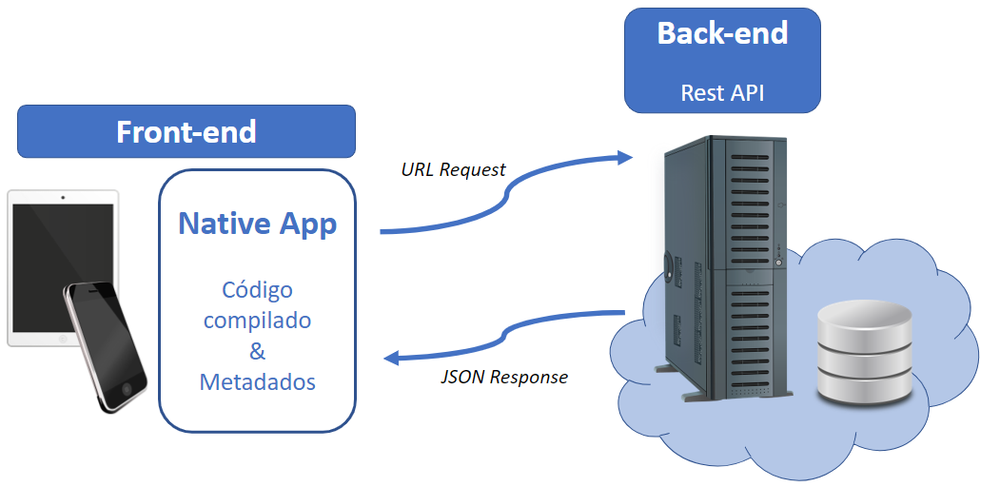
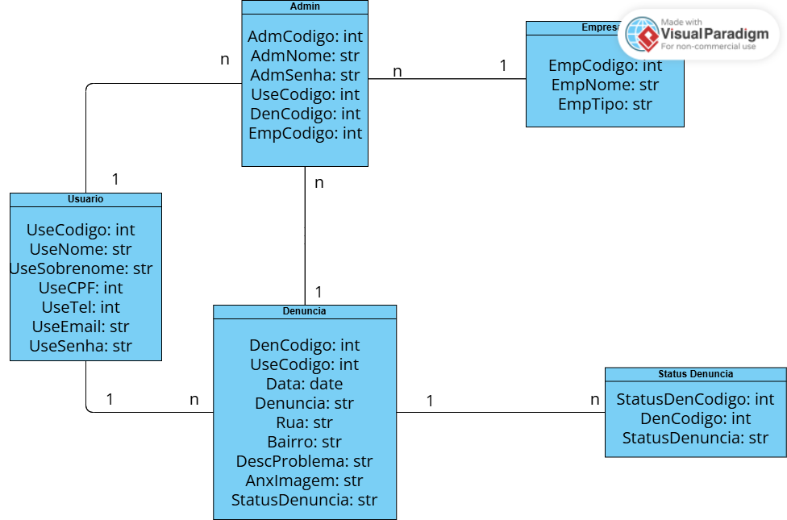
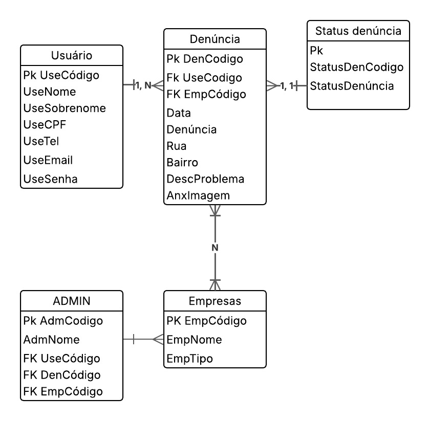

# Arquitetura da solução

<span style="color:red">Pré-requisitos: <a href="04-Projeto-interface.md"> Projeto de interface</a></span>

Definição de como o software é estruturado em termos dos componentes que fazem parte da solução e do ambiente de hospedagem da aplicação.



## Diagrama de classes

O diagrama de classes ilustra graficamente a estrutura do software e como cada uma das classes estará interligada. Essas classes servem de modelo para materializar os objetos que serão executados na memória.



> **Links úteis**:
> - [Diagramas de classes - documentação da IBM](https://www.ibm.com/docs/pt-br/rational-soft-arch/9.7.0?topic=diagrams-class)
> - [O que é um diagrama de classe UML?](https://www.lucidchart.com/pages/pt/o-que-e-diagrama-de-classe-uml)

##  Modelo de dados

### Esquema relacional

Respresentação do esquema relacional entre administradores, usuários e empresas 
 

---

### Modelo físico

Script de tabelas do site:

```sql
-- Criação da tabela Admin
CREATE TABLE Admin (
    AdmCodigo INTEGER PRIMARY KEY,
    AdmNome VARCHAR(100),
    AdmSenha VARCHAR(100),
    FOREIGN KEY (UseCodigo) REFERENCES Usuario(UseCodigo),
    FOREIGN KEY (DenCodigo) REFERENCES Denuncia(DenCodigo),
    FOREIGN KEY (EmpCodigo) REFERENCES Empresas(EmpCodigo)
    
);

-- Criação da tabela Usuário
CREATE TABLE Usuario (
    UseCodigo INTEGER PRIMARY KEY,
    UseNome VARCHAR(100),
    UseSobrenome VARCHAR(100),
    UseCPF VARCHAR(100),
    UseTel VARCHAR(100),
    UseEmail VARCHAR(100),
    UseSenha VARCHAR(100)
);

-- Criação da tabela Denúncia
CREATE TABLE Denuncia (
    DenCodigo INTEGER PRIMARY KEY,
    UseCodigo INTEGER,
    Data DATE,
    Denuncia VARCHAR(100),
    Rua VARCHAR(100),
    Bairro VARCHAR(100),
    DescProblema VARCHAR(100),
    AnxImagem VARCHAR(255), //Caminho da imagem
    StausDenuncia VARCHAR(100),
    FOREIGN KEY (UseCodigo) REFERENCES Usuario(UseCodigo)
);

-- Criação da tabela Status
CREATE TABLE StatusDenuncia (
    StatusDenCodigo INTEGER PRIMARY KEY,
    DenCodigo INTEGER,
    StausDenuncia VARCHAR(100),
    FOREIGN KEY (DenCodigo) REFERENCES Denuncia(DenCodigo)
);


-- Criação da tabela Empresas responsáveis
CREATE TABLE Empresas (
    EmpCodigo INTEGER PRIMARY KEY,
    EmpNome VARCHAR(100),
    EmpTipo VARCHAR(100), //Água, luz, etc
    FOREIGN KEY (Denuncia) REFERENCES Denuncia(Denuncia)
);
```
Esse script deverá ser incluído em um arquivo .sql na pasta [de scripts SQL](../src/db).


## Tecnologias

O site é concebido através do C# no back-end, responsável pelas principais funcionalidades do site, como: Fazer denúncias. O Banco de dados utilizado é o MongoDB, guardando dados tanto de usuários (informações pessoais e denúncias), quanto de empresas (para resolver as queixas dos usuários)

O Front-End é bem simples e utiliza HTML, CSS e JS para assumir sua "fisionomia". O projeto todo é atualizado via Github.


| **Dimensão**   | **Tecnologia**  |
| ---            | ---             |
| Front-end      | HTML + CSS + JS |
| Back-end       | C#        |
| SGBD           | MongoDB           |
| Deploy         | Github          |


## Hospedagem

Explique como a hospedagem e o lançamento da plataforma foram realizados.

> **Links úteis**:
> - [Website com GitHub Pages](https://pages.github.com/)
> - [Programação colaborativa com Repl.it](https://repl.it/)
> - [Getting started with Heroku](https://devcenter.heroku.com/start)
> - [Publicando seu site no Heroku](http://pythonclub.com.br/publicando-seu-hello-world-no-heroku.html)

## Qualidade de software

Conceituar qualidade é uma tarefa complexa, mas ela pode ser vista como um método gerencial que, por meio de procedimentos disseminados por toda a organização, busca garantir um produto final que satisfaça às expectativas dos stakeholders.

No contexto do desenvolvimento de software, qualidade pode ser entendida como um conjunto de características a serem atendidas, de modo que o produto de software atenda às necessidades de seus usuários. Entretanto, esse nível de satisfação nem sempre é alcançado de forma espontânea, devendo ser continuamente construído. Assim, a qualidade do produto depende fortemente do seu respectivo processo de desenvolvimento.

A norma internacional ISO/IEC 25010, que é uma atualização da ISO/IEC 9126, define oito características e 30 subcaracterísticas de qualidade para produtos de software. Com base nessas características e nas respectivas subcaracterísticas, identifique as subcaracterísticas que sua equipe utilizará como base para nortear o desenvolvimento do projeto de software, considerando alguns aspectos simples de qualidade. Justifique as subcaracterísticas escolhidas pelo time e elenque as métricas que permitirão à equipe avaliar os objetos de interesse.

> **Links úteis**:
> - [ISO/IEC 25010:2011 - Systems and Software Engineering — Systems and Software Quality Requirements and Evaluation (SQuaRE) — System and Software Quality Models](https://www.iso.org/standard/35733.html/)
> - [Análise sobre a ISO 9126 – NBR 13596](https://www.tiespecialistas.com.br/analise-sobre-iso-9126-nbr-13596/)
> - [Qualidade de software - Engenharia de Software](https://www.devmedia.com.br/qualidade-de-software-engenharia-de-software-29/18209)
