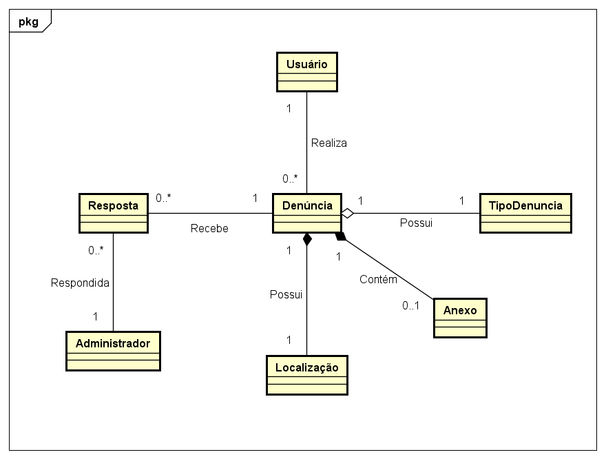

# Arquitetura da solução

<span style="color:red">Pré-requisitos: <a href="04-Projeto-interface.md"> Projeto de interface</a></span>

<p align="justify">A arquitetura da solução proposta foi estruturada seguindo o modelo cliente-servidor, no qual o front-end e o back-end se comunicam através de uma API REST. O sistema é composto por três camadas principais: a interface do usuário (front-end), a lógica de negócios e serviços (back-end) e o banco de dados.</p>
<p align="justify">O front-end é uma aplicação web responsiva desenvolvida com HTML, CSS e JavaScript, com foco na experiência mobile, podendo ser empacotada como aplicativo utilizando ferramentas como Capacitor ou Cordova. Esta camada é responsável por capturar as interações do usuário e enviar as requisições HTTP para o servidor.</p>
<p align="justify">O back-end foi desenvolvido com Node.js e Express, sendo responsável pelo processamento das requisições, validação dos dados, controle de acesso e envio das respostas ao front-end. Toda a comunicação entre front-end e back-end é feita por meio de chamadas à API REST, utilizando o formato JSON.</p>
<p align="justify">Os dados são armazenados em um banco de dados NoSQL MongoDB, que oferece flexibilidade e escalabilidade para o sistema. Ele armazena informações como denúncias registradas, status de atendimento, dados de usuários e imagens, garantindo performance mesmo com grandes volumes de dados.</p>


## Diagrama de classes

<p align="justify">O diagrama de classes a seguir representa a estrutura lógica da aplicação proposta, evidenciando como as principais entidades do sistema se relacionam entre si. Ele serve como base para o desenvolvimento orientado a objetos, permitindo a modelagem de atributos e comportamentos essenciais para o funcionamento do sistema de denúncias de problemas urbanos.</p>
<p align="justify">Por meio dele, é possível visualizar como os usuários interagem com o sistema ao realizar denúncias, que por sua vez possuem tipo, localização e podem conter anexos. As denúncias também podem receber respostas de administradores, que são responsáveis por acompanhar e responder as solicitações da população.</p>
<p align="justify">Esse modelo contribui para a organização do código, facilitando a implementação, a manutenção e a escalabilidade da aplicação.</p>

<p align="center">
  
</p>


##  Modelo de dados

### Esquema relacional

Respresentação do esquema relacional entre administradores, usuários e empresas 
 
<p align="center">
  
</p>

---

### Modelo físico

Script de tabelas do site:

```sql
-- Criação da tabela Admin
CREATE TABLE Admin (
    AdmCodigo INTEGER PRIMARY KEY,
    AdmNome VARCHAR(100),
    AdmSenha VARCHAR(100),
    FOREIGN KEY (UseCodigo) REFERENCES Usuario(UseCodigo),
    FOREIGN KEY (DenCodigo) REFERENCES Denuncia(DenCodigo),
    FOREIGN KEY (EmpCodigo) REFERENCES Empresas(EmpCodigo)
    
);

-- Criação da tabela Usuário
CREATE TABLE Usuario (
    UseCodigo INTEGER PRIMARY KEY,
    UseNome VARCHAR(100),
    UseSobrenome VARCHAR(100),
    UseCPF VARCHAR(100),
    UseTel VARCHAR(100),
    UseEmail VARCHAR(100),
    UseSenha VARCHAR(100)
);

-- Criação da tabela Denúncia
CREATE TABLE Denuncia (
    DenCodigo INTEGER PRIMARY KEY,
    UseCodigo INTEGER,
    Data DATE,
    Denuncia VARCHAR(100),
    Rua VARCHAR(100),
    Bairro VARCHAR(100),
    DescProblema VARCHAR(100),
    AnxImagem VARCHAR(255), //Caminho da imagem
    StausDenuncia VARCHAR(100),
    FOREIGN KEY (UseCodigo) REFERENCES Usuario(UseCodigo)
);

-- Criação da tabela Status
CREATE TABLE StatusDenuncia (
    StatusDenCodigo INTEGER PRIMARY KEY,
    DenCodigo INTEGER,
    StausDenuncia VARCHAR(100),
    FOREIGN KEY (DenCodigo) REFERENCES Denuncia(DenCodigo)
);


-- Criação da tabela Empresas responsáveis
CREATE TABLE Empresas (
    EmpCodigo INTEGER PRIMARY KEY,
    EmpNome VARCHAR(100),
    EmpTipo VARCHAR(100), //Água, luz, etc
    FOREIGN KEY (Denuncia) REFERENCES Denuncia(Denuncia)
);
```
Esse script deverá ser incluído em um arquivo .sql na pasta [de scripts SQL](../src/db).


## Tecnologias

O site é concebido através do C# no back-end, responsável pelas principais funcionalidades do site, como: Fazer denúncias. O Banco de dados utilizado é o MongoDB, guardando dados tanto de usuários (informações pessoais e denúncias), quanto de empresas (para resolver as queixas dos usuários)

O Front-End é bem simples e utiliza HTML, CSS e JS para assumir sua "fisionomia". O projeto todo é atualizado via Github.


| **Dimensão**   | **Tecnologia**  |
| ---            | ---             |
| Front-end      | HTML + CSS + JS |
| Back-end       | C#        |
| SGBD           | MongoDB           |
| Deploy         | Github          |


## Hospedagem

Explique como a hospedagem e o lançamento da plataforma foram realizados.

> **Links úteis**:
> - [Website com GitHub Pages](https://pages.github.com/)
> - [Programação colaborativa com Repl.it](https://repl.it/)
> - [Getting started with Heroku](https://devcenter.heroku.com/start)
> - [Publicando seu site no Heroku](http://pythonclub.com.br/publicando-seu-hello-world-no-heroku.html)

## Qualidade de software

<p align="justify">Garantir a qualidade de um software voltado à gestão de infraestrutura urbana é essencial para assegurar que o sistema atenda de forma eficaz às necessidades da população e das autoridades envolvidas na manutenção da cidade. No contexto deste projeto, qualidade não é apenas uma meta técnica, mas um compromisso com a eficiência, a usabilidade e a confiabilidade da solução, considerando o impacto direto que ela exerce no cotidiano dos cidadãos.</p>
<p align="justify">A qualidade do software, neste caso, deve garantir que o sistema seja acessível, responsivo, seguro e funcional, promovendo uma comunicação ágil e transparente entre os usuários (cidadãos) e os gestores públicos. Como o objetivo do sistema é solucionar problemas reais como falhas na iluminação, buracos nas vias ou vazamentos de água, a experiência do usuário e a robustez do sistema são critérios fundamentais.</p>
<p align="justify">Para nortear o desenvolvimento, a equipe adotou como base a norma internacional ISO/IEC 25010, que define características e subcaracterísticas de qualidade aplicáveis a produtos de software. A partir dessa norma, as subcaracterísticas selecionadas para guiar a construção do sistema foram:</p>

- **Usabilidade** (subcaracterísticas: adequação ao uso, facilidade de aprendizado, operabilidade): o sistema deve ser intuitivo e fácil de usar, mesmo para usuários com pouca familiaridade com tecnologia, permitindo que qualquer cidadão possa registrar uma ocorrência sem dificuldades.
  
- **Confiabilidade** (maturidade e tolerância a falhas): a aplicação precisa funcionar corretamente mesmo em diferentes situações de uso, reduzindo falhas que possam comprometer a confiança do cidadão no serviço.
  
- **Eficiência de Desempenho** (tempo de resposta): considerando que a aplicação será usada em dispositivos móveis e, muitas vezes, em locais com acesso limitado à internet, o tempo de resposta deve ser rápido para garantir uma boa experiência ao usuário.
  
- **Segurança** (confidencialidade e proteção de dados): por envolver o cadastro de usuários e envio de denúncias com localização e imagens, é essencial proteger os dados pessoais e garantir a integridade das informações.

