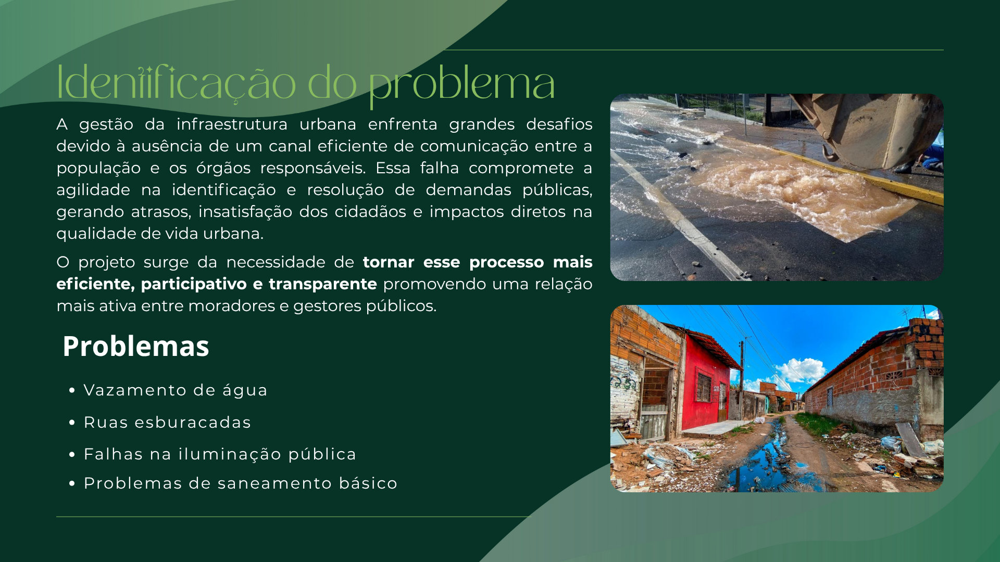
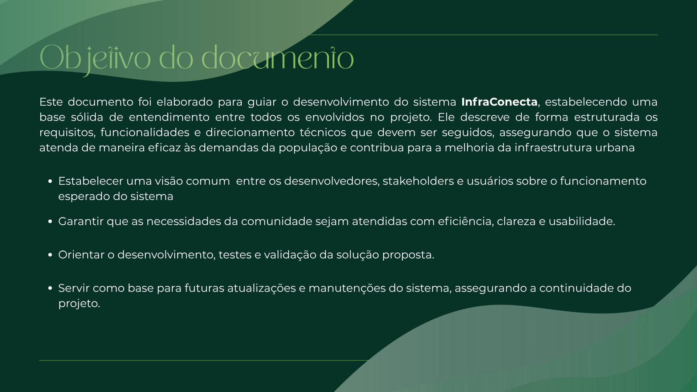
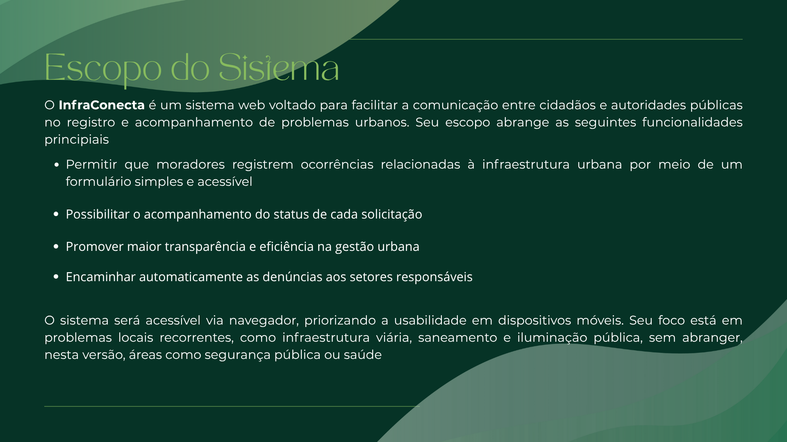
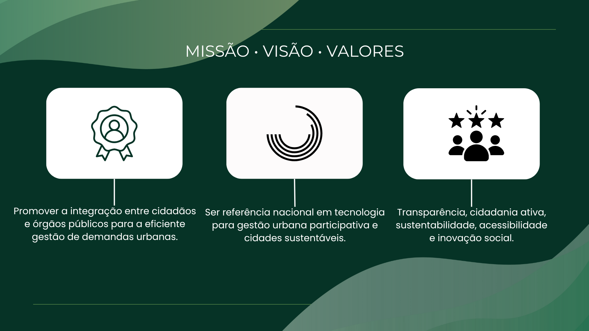
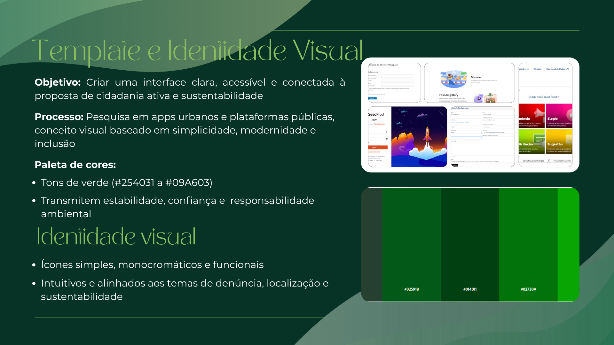
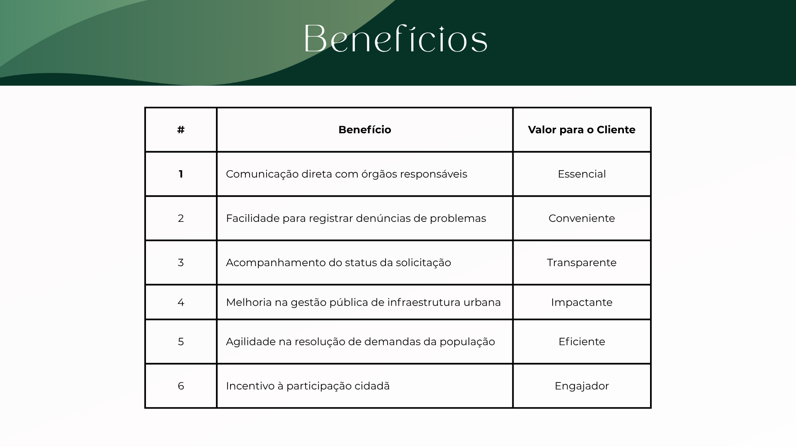
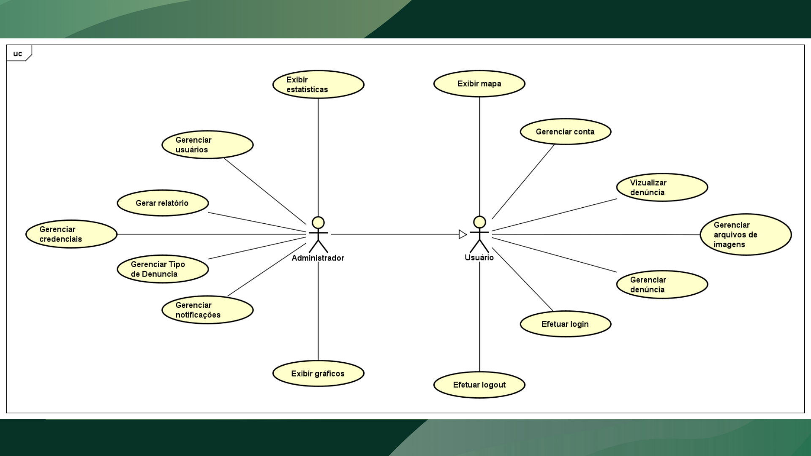
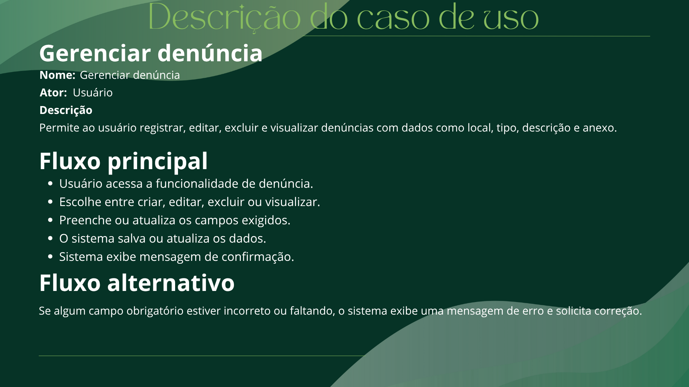
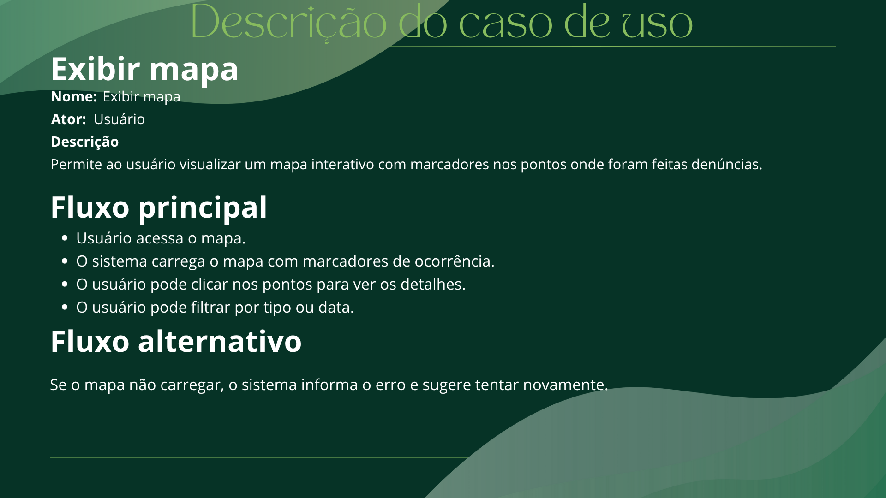

# Apresentação do projeto

Pré-requisitos: Todos os demais artefatos

## Slides

## Vídeo

O grupo também deverá gravar um vídeo de até cinco minutos apresentando a solução. O vídeo deve incluir uma demonstração da aplicação hospedada, mostrando seu funcionamento.

Podem utilizar quaisquer recursos na produção do vídeo, mas certifiquem-se de destacar as funcionalidades da aplicação.

A seguir, estão as especificações técnicas que devem ser seguidas na criação do vídeo:

> - tamanho do arquivo limitado a 90Mb
> - taxa de FPS limitada a 30 quadros por segundo
> - resolução HD (720p) ou Full HD (1080p)
> - formato mp4.

