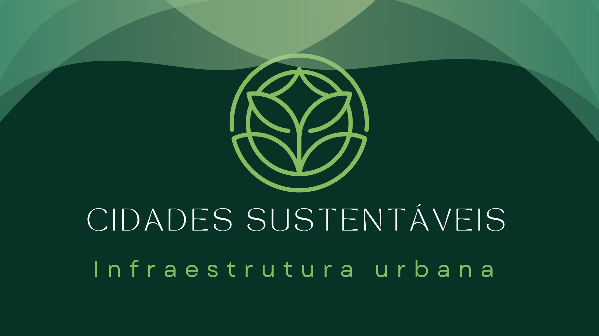
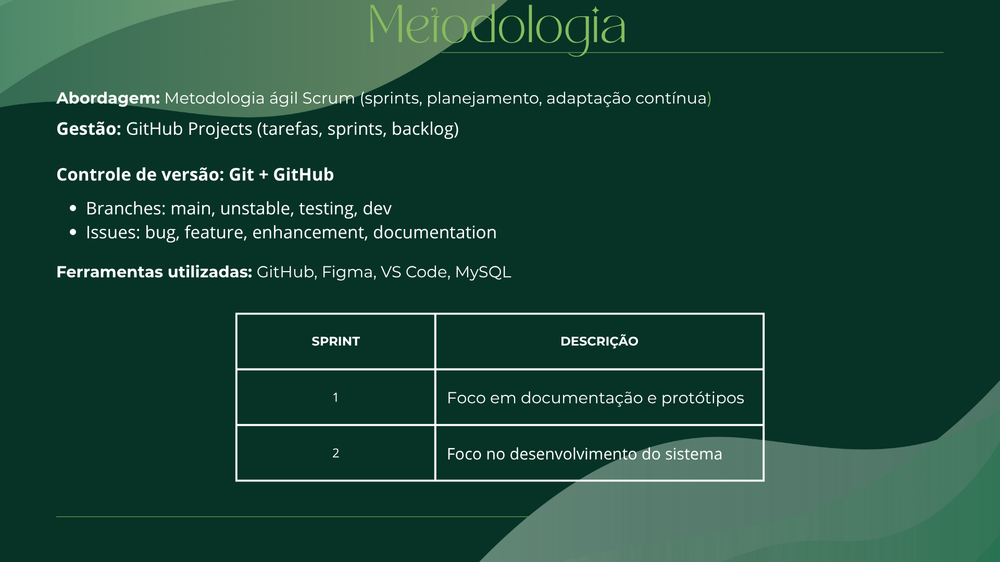

# Apresentação do projeto

Este projeto tem como objetivo desenvolver uma solução tecnológica voltada para a promoção de cidades mais sustentáveis, com foco na infraestrutura urbana. A proposta permite que cidadãos relatem, de forma simples e acessível, problemas como buracos nas vias, postes danificados, entulho, entre outros, ajudando na organização das demandas e facilitando a atuação do poder público.

Abaixo, apresentamos uma série de slides que detalham todas as etapas do projeto, desde a concepção da ideia até a estrutura da solução desenvolvida. Ao final, disponibilizamos também um vídeo demonstrativo, que explica de forma prática como utilizar a plataforma.

Além da apresentação, convidamos você a explorar as demais seções disponíveis no menu lateral, onde estão documentados todos os artefatos do projeto — como contexto, especificações, metodologia, testes, interface e referências — oferecendo uma visão completa e estruturada do desenvolvimento.

## Slides

## Vídeo

O grupo também deverá gravar um vídeo de até cinco minutos apresentando a solução. O vídeo deve incluir uma demonstração da aplicação hospedada, mostrando seu funcionamento.

Podem utilizar quaisquer recursos na produção do vídeo, mas certifiquem-se de destacar as funcionalidades da aplicação.

A seguir, estão as especificações técnicas que devem ser seguidas na criação do vídeo:

> - tamanho do arquivo limitado a 90Mb
> - taxa de FPS limitada a 30 quadros por segundo
> - resolução HD (720p) ou Full HD (1080p)
> - formato mp4.

